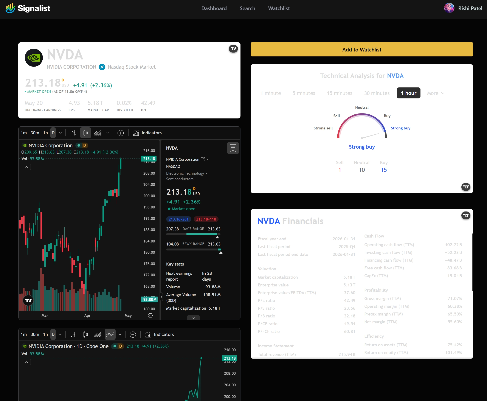
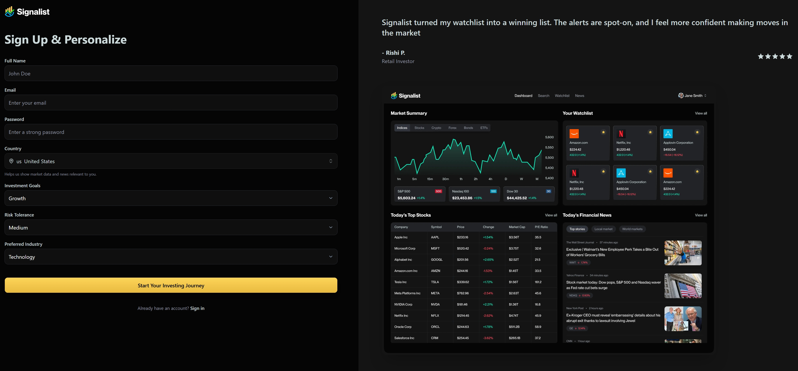
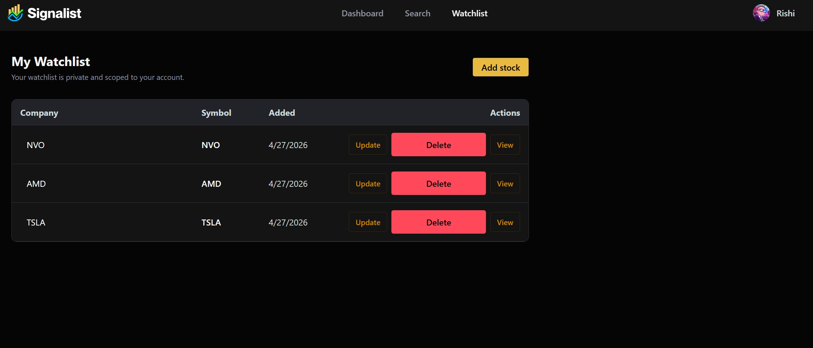

# Signalist - Full-Stack Stock Intelligence Platform

## Overview

Signalist is a full-stack web application for tracking market activity, exploring stock-level insights, and managing a personalized watchlist with secure, user-scoped data access.
It combines live market data, interactive charting, account-based workflows, and background automations to deliver a focused decision-support experience for individual investors and traders.

Built on modern web architecture, the project started from a tutorial foundation and evolved into a significantly expanded, production-oriented implementation with custom features, improved structure, and independent engineering decisions.

---

## Features

### Core Features

- Secure email/password authentication and session-based access control
- Real-time market widgets and stock detail views
- Searchable stock discovery workflow
- Personalized dashboard experience for signed-in users
- Scheduled market-news summarization pipeline with email delivery

### Custom Features (Extended Beyond Tutorial)

- Full CRUD watchlist system with dedicated `/watchlist` page
- User-isolated watchlist persistence (strict per-user data scoping)
- Search-integrated watchlist controls (add/remove directly from search results)
- Watchlist status hydration across stock pages and search responses
- Improved server-action architecture for secure data mutations
- Expanded Inngest workflows and email personalization logic

---

## Tech Stack

- **Framework:** Next.js (App Router), React, TypeScript
- **Styling/UI:** Tailwind CSS, shadcn/ui, custom component system
- **Authentication:** Better Auth
- **Database:** MongoDB + Mongoose
- **Background Jobs:** Inngest
- **Email Delivery:** Nodemailer (Gmail SMTP)
- **Market Data:** Finnhub API
- **Charts/Visualization:** TradingView embedded widgets
- **Tooling:** ESLint, npm

---

## Architecture / How It Works

At a high level, the app follows a server-first architecture:

1. **Auth + Session Layer**
   - Better Auth manages sign-up/sign-in/session lifecycle.
   - Protected routes enforce authenticated access in root layouts and server actions.

2. **Domain Actions Layer**
   - Server actions handle business logic for stocks, watchlist, user retrieval, and auth workflows.
   - Sensitive operations (watchlist CRUD, session operations) run server-side with session validation.

3. **Persistence Layer**
   - MongoDB stores users and watchlist entities.
   - Watchlist records are keyed by authenticated user identity to enforce strict ownership boundaries.

4. **Background Processing**
   - Inngest handles scheduled and event-driven functions.
   - Daily jobs gather user-specific context, generate summaries, and trigger transactional emails.

5. **Presentation Layer**
   - App Router pages + reusable UI components render dashboard, search, stock details, and watchlist workflows.
   - Client components provide responsive interactions while server actions preserve data integrity.

---

## Screenshots

The following screenshots represent key workflows and UI surfaces:








---

## Getting Started

### 1) Installation

```bash
git clone <your-repo-url>
cd stocks_app
npm install
```

### 2) Environment Setup

Create a `.env.local` file in the project root:

```env
# Database
MONGODB_URI=

# Auth
BETTER_AUTH_SECRET=
BETTER_AUTH_URL=

# Market data
FINNHUB_API_KEY=
NEXT_PUBLIC_FINNHUB_API_KEY=

# Inngest AI integration
INNGEST_GEMINI_API_KEY=

# Email
NODEMAILER_EMAIL=
NODEMAILER_PASSWORD=
```

### 3) Run Locally

```bash
npm run dev
```

Application: [http://localhost:3000](http://localhost:3000)

---

## API / Key Functionality

### Authentication & Session

- Server-validated sign-in/sign-up/sign-out flows
- Route protection and user session checks in App Router layouts

### Watchlist Domain

- Create, read, update, and delete watchlist entries
- Per-user authorization enforced in server actions
- Search results enriched with `isInWatchlist` state for current user

### Market Data

- Search and stock retrieval via Finnhub-backed actions
- Contextual symbol-based and general market news flows

### Automation & Email

- Inngest event/cron functions for scheduled workflows
- Personalized email generation and delivery via Nodemailer

---

## Improvements Over Tutorial

This project intentionally goes beyond the source tutorial in scope and implementation quality. Major additions include:

- End-to-end custom watchlist CRUD with secure multi-user boundaries
- Dedicated watchlist management page and richer user workflows
- Expanded server-action structure for better separation of concerns
- Enhanced integration between search, stock detail views, and persisted watchlist state
- Strengthened background job behavior and news email pipeline
- Additional reliability, validation, and architecture refinements for production readiness

---

## Acknowledgements

This project was initially inspired by a tutorial from JavaScript Mastery:
[Build and Deploy a Full Stack Stock Market App](https://www.youtube.com/watch?v=gu4pafNCXng&t=8362s)

The current codebase includes substantial original development, feature expansion, and architectural improvements beyond the tutorial baseline.

---

## Future Improvements

- Add historical watchlist performance snapshots and P/L analytics
- Introduce alert rule engine (price/volume/news-triggered notifications)
- Add comprehensive test coverage (unit, integration, and e2e)
- Improve observability (structured logging, job monitoring, error tracing)
- Support multiple market-data providers with failover strategy
- Add role-based admin tooling for operational controls
